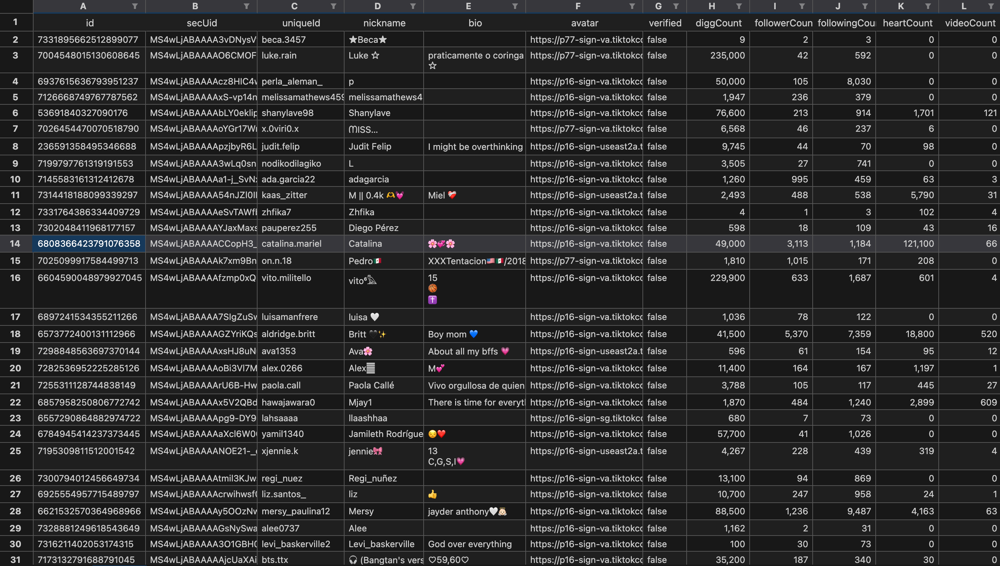

# Tiktok Follower Crawler
[](https://github.com/BloodhoundSpace/tiktok-follower-crawler/stargazers/)
[](https://github.com/BloodhoundSpace/tiktok-follower-crawler/network/)
[](https://twitter.com)

Get the maximum number of followers of a user on TikTok and save it to an Excel file ♪



## Getting Started

### Install requirements
Install the necessary libraries from the `requirements.txt` file
```bash
pip install -r requirements.txt
```

### Configuration
Before running the script, you need to configure some parameters in the `main.py` file. Open this file with a text editor and change the following values:

- `USER_SEC_UID`: SecUID of the user you want to crawl data from. [How to retrieve Tiktok SecUID? 👇](#how-to-retrieve-tiktok-secuid)
- `COUNT`: Number of followers you want to retrieve

### Running the Script
Once you have configured the parameters, you can run the script using the following command:

```bash
python main.py
```

### Results
The script will generate the results in the form of an Excel file, named `{YOUR_USER_SEC_UID}.xlsx`


## Example
You can go to `public/taylorswift_followers.xlsx` to see an example of Taylor's followers.

Here is data from the TikTok API. You can update the fields you want to retrieve in the `TiktokApi.py` file.
```json
{
  "stats": {
      "diggCount": 10800,
      "followerCount": 58,
      "followingCount": 588,
      "friendCount": 0,
      "heart": 24,
      "heartCount": 24,
      "videoCount": 5
  },
  "user": {
    "avatarLarger": "https://p16-sign-va.tiktokcdn.com/tos-maliva-avt-0068/85356fc2d14db4ca20657d757d903478~c5_1080x1080.jpeg?lk3s=a5d48078&x-expires=1707300000&x-signature=KsmOOerPm2rnVQQtrMQkmwC86bs%3D",
    "avatarMedium": "https://p16-sign-va.tiktokcdn.com/tos-maliva-avt-0068/85356fc2d14db4ca20657d757d903478~c5_720x720.jpeg?lk3s=a5d48078&x-expires=1707300000&x-signature=vtGCBnBPdufeyWBYKJSVpEmvh7o%3D",
    "avatarThumb": "https://p16-sign-va.tiktokcdn.com/tos-maliva-avt-0068/85356fc2d14db4ca20657d757d903478~c5_100x100.jpeg?lk3s=a5d48078&x-expires=1707300000&x-signature=7jXE7wxYK3nE3lgvEDMyG8j3HQM%3D",
    "commentSetting": 1,
    "downloadSetting": 3,
    "duetSetting": 3,
    "ftc": false,
    "id": "7300225061264360454",
    "isADVirtual": false,
    "nickname": "Chrisha",
    "openFavorite": true,
    "privateAccount": true,
    "relation": 0,
    "secUid": "MS4wLjABAAAAXoAzBa50vc2MxIGTJBQOXshrdL5D-g5fFJgmMEtn-32jIwXzdrlXEso5NJ_8VAR_",
    "secret": true,
    "signature": "",
    "stitchSetting": 3,
    "ttSeller": false,
    "uniqueId": "risha_hsf",
    "verified": false
  }
}
```

## How to retrieve Tiktok SecUID

You can obtain the `SecUID` by using my API (Get User Info) at [link](https://rapidapi.com/Lundehund/api/tiktok-api23) (don't worry, you can use it for free 😼). 

Additionally, you can utilize more than 20 other TikTok APIs available there.

If you encounter any issues, don't hesitate to get in touch with me ✌️.
